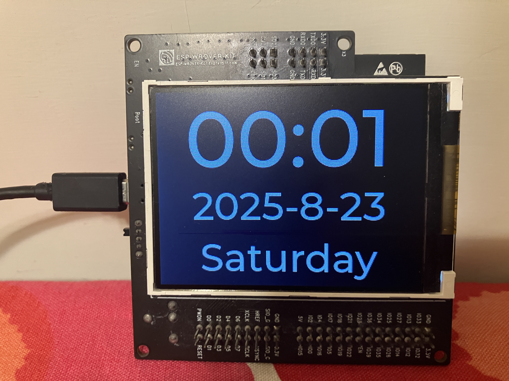

## Install Arduino IDE 2.3.6
[link](https://www.arduino.cc/en/software/)  

## Install Library
Library manager -> search below lib -> install

|   Lib    | version |    config    |
|----------|---------|--------------|
| TFT_eSPI | 2.5.43  | User_Setup.h |
|   lvgl   | 9.3.0   | lv_conf.h    |

## Add esp32 Board
1. File -> Preferences -> Additional boards manager URLs -> `https://espressif.github.io/arduino-esp32/package_esp32_index.json`  
2. Boards manager -> search `esp32` by espressif systems -> install  

## Add 96 px font 
merge `lvgl_font_96` to `C:\Users\xxx\Documents\Arduino\libraries\lvgl`  

I create by  
1. get the montserrat font [link](https://fonts.google.com/specimen/Montserrat)  
2. font conversion tool [link](https://lvgl.io/tools/fontconverter)  

## Note
1. board select `esp32 wrover module`  
2. Tools -> Partition scheme -> "Huge APP (3MB No OTA/1MB SPIFFS)".  
3. Tools -> Flash mode -> DIO   (if set QIO, can not boot on my wrover kit )  

## Demo 
  

## RGB led  
|  status  |   description   |
|----------|-----------------|
| B blink  | wifi connecting |
| B on     | wifi connected  |
| G on     | ntp sync ok     |
| R on     | ntp sync fail   |